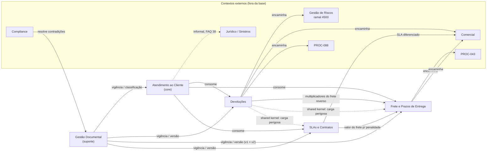

# NovaTech Assistant — Recorte de Domínio

> Bounded contexts e linguagem ubíqua do NovaTech Assistant. Referência para o time e para os agentes de IA (Copilot, Claude Code).

| Campo | Valor |
|---|---|
| **Fonte de verdade** | Anexo A (POL-001, PROC-042, PROC-042-v2, SLA-2024, FAQ-Atendimento) |
| **Apoio** | Anexo B (chunks de referência do pipeline de RAG) |
| **Convenção de citação** | `DOC §seção` (ex.: `POL-001 §3.2`). O FAQ é citado por item (`FAQ Item 15`). |
| **Exercício** | 2.1 — Recorte de domínio e spec SDD (Tarefa 1) |
| **Caminho sugerido** | `docs/domain/bounded-contexts-e-linguagem-ubiqua.md` |

## Sumário

- [1. Bounded contexts](#1-bounded-contexts)
  - [1.1 Decisão sobre os pontos de partida](#11-decisão-sobre-os-pontos-de-partida)
  - [1.2 Atendimento ao Cliente](#12-contexto-a--atendimento-ao-cliente)
  - [1.3 Devoluções](#13-contexto-b--devoluções)
  - [1.4 Frete e Prazos de Entrega](#14-contexto-c--frete-e-prazos-de-entrega)
  - [1.5 SLAs e Contratos](#15-contexto-d--slas-e-contratos)
  - [1.6 Gestão Documental](#16-contexto-e--gestão-documental)
  - [1.7 Mapa de relacionamento](#17-mapa-de-relacionamento)
  - [1.8 Fronteira do assistente](#18-fronteira-do-assistente-o-que-ele-faz-e-o-que-não-faz)
  - [1.9 Perguntas que cruzam categorias](#19-perguntas-que-cruzam-categorias-os-15-do-discovery)
- [2. Linguagem ubíqua — Glossário](#2-linguagem-ubíqua--glossário)
- [3. Termos sem definição na base](#3-termos-sem-definição-na-base)
- [4. Contradições adicionais encontradas](#4-contradições-adicionais-encontradas)
- [5. Cobertura da linguagem ubíqua nos chunks (Anexo B)](#5-cobertura-da-linguagem-ubíqua-nos-chunks-anexo-b)
- [6. Perguntas em aberto para validar com a NovaTech](#6-perguntas-em-aberto-para-validar-com-a-novatech)

---

## 1. Bounded contexts

### 1.1 Decisão sobre os pontos de partida

| Ponto de partida sugerido | Decisão | Justificativa no Anexo A |
|---|---|---|
| Atendimento ao Cliente | **Confirmado** | É onde o atendente atua. O FAQ inteiro é escrito do ponto de vista dele ("O que respondo?", "O que faço?"). |
| Gestão Documental | **Confirmado (contexto de suporte)** | Cada documento tem Versão, Status/Classificação e Responsável próprios. A coexistência de PROC-042 v1 e v2 "sem hierarquia clara" (PROC-042-v2, cabeçalho) é um problema de governança documental, não de frete. |
| SLAs e Contratos | **Confirmado** | O SLA-2024 é o único "Documento contratual" da base (cabeçalho) e define tiers, SLAs de atendimento, incidente crítico e penalidades. |
| Logística de Frete | **Ajustado → "Frete e Prazos de Entrega"** | O único conteúdo de frete da base é o **frete especial** (PROC-042 §1). O único prazo de entrega documentado está no PROC-042 §3 (prazo padrão da rota + dias úteis). A categoria "prazos de entrega" do discovery cai aqui. |
| *(não sugerido)* | **Novo → "Devoluções"** | O POL-001 tem responsável próprio (Diretoria de Operações, diferente da Diretoria Comercial do PROC-042), seus próprios prazos (7 dias úteis, 4 horas úteis de triagem, 2 e 5 dias úteis) e regras de elegibilidade. "Política de devolução" também é uma das 4 categorias do discovery. Deixar isso dentro de "Atendimento" misturaria regra de negócio com orientação ao atendente. |

Também existem **contextos externos**. A base cita esses contextos, mas não os documenta: Gestão de Riscos, Comercial, Jurídico/Sinistros e Compliance, além dos documentos PROC-088 e PROC-043, que não estão na base. O assistente só pode **encaminhar** para eles, nunca responder por eles.

---

### 1.2 Contexto A — Atendimento ao Cliente

> **Tipo:** core (é o contexto do assistente)

**DENTRO**
- Orientação prática ao atendente: o que responder e para onde encaminhar (FAQ Itens 3, 15, 27, 38, 45).
- Identificação do cliente pelo atendente, com o pedido do número do contrato (FAQ Item 15).
- Pergunta sobre rastreamento e a abertura de "chamado de rastreamento" (FAQ Item 27). Isso é informal.
- Limites de autonomia do atendente: "Atendente não tem autonomia para dar desconto" (FAQ Item 45). Isso também é informal.
- Encaminhamentos documentados: Gestão de Riscos ramal 4500 (POL-001 §3.2), Comercial (POL-001 §3.5; SLA-2024 §1 Nota), sinistros@novatech.com.br (FAQ Item 38, informal).
- Documento de origem: **FAQ-Atendimento** (classificação: "Documento informal — NÃO validado").

**FORA**
- As regras em si: elegibilidade de devolução (→ Devoluções), fórmula de frete (→ Frete e Prazos), valores de SLA (→ SLAs e Contratos).
- A validade de cada documento (→ Gestão Documental).
- A decisão de exceções (→ Gestão de Riscos, Comercial ou Jurídico, que são externos).

**Relações e mudanças de significado**
- Consome os três contextos de regra de negócio e o metadado de classificação da Gestão Documental.
- **"Chamado"** aqui é a interação do atendente com o cliente. Em SLAs e Contratos, é a unidade de medição com timestamp no Azure DevOps (SLA-2024 §5). Em Devoluções, é a solicitação que o *cliente* abre no Portal do Cliente (POL-001 §3.3). Em Frete, a data de abertura do chamado decide qual versão da PROC-042 vale (PROC-042-v2 §5).
- **"Prioridade alta"** (FAQ Item 27) só existe aqui e **não** é "incidente crítico" (SLA-2024 §3).

**Categorias do discovery:** todas as 4, como ponto de entrada. Ele não é dono das regras de nenhuma delas.

---

### 1.3 Contexto B — Devoluções

**DENTRO** (POL-001 inteiro)
- Prazo geral de 7 dias úteis após o recebimento confirmado no tracking, com a definição de dias úteis (§3.1).
- Exceções: carga perigosa (classes 1 a 6 da ANTT), carga refrigerada com cadeia de frio rompida e lacre violado (§3.2).
- Procedimento: Portal do Cliente, CT-e, 3 fotos, triagem em 4 horas úteis, coleta reversa agendada em até 2 dias úteis, reembolso ou crédito em até 5 dias úteis (§3.3).
- Devolução parcial (§3.4) e custos por motivo (§3.5).
- **Dono da definição de "carga perigosa"**, que é compartilhada com os outros contextos (*shared kernel*).

**FORA**
- Mercadoria ainda em trânsito (→ PROC-088, externo e fora da base; POL-001 §2).
- Tratamento individual das exceções (→ Gestão de Riscos, externo).
- Negociação de prazo expirado (→ Comercial, externo).
- Cálculo dos multiplicadores do frete reverso (→ Frete e Prazos).
- Carga danificada em trânsito como "sinistro" (→ Jurídico, externo; só aparece no FAQ Item 38).

**Relações e mudanças de significado**
- **Consome Frete e Prazos:** o frete reverso por desistência é "calculado com os mesmos multiplicadores do frete original" (POL-001 §3.5).
- **Fornece "carga perigosa"** para Frete (PROC-042 §4) e para SLAs (SLA-2024 §3, incidente crítico).
- **"Prazo"** aqui é o limite para o *cliente pedir* a devolução (dias úteis). Em Frete, é prazo de entrega. Em SLAs, é tempo de resposta ou resolução.
- **"Processo padrão"** aqui é o fluxo do §3.3. Não tem relação com o tier "Standard" nem com um "frete padrão".
- **Conflito de fronteira:** POL-001 §3.5 trata "avaria em trânsito" *dentro* da devolução, sem custo para o cliente. O FAQ Item 38 diz que carga danificada "tem processo diferente de devolução".

**Categorias do discovery:** política de devolução.

---

### 1.4 Contexto C — Frete e Prazos de Entrega

**DENTRO** (PROC-042 v1 e PROC-042-v2)
- Definição de frete especial para carga acima de 500kg (§1).
- Fórmula: Valor base × Multiplicador regional × Fator de peso (§2).
- Multiplicadores regionais (§2.1), **diferentes entre v1 e v2**.
- Fator de peso por faixa, **diferente entre v1 e v2**.
- Prazo de entrega do frete especial: prazo padrão da rota + 2 dias úteis (v1) ou + 3 dias úteis (v2) (§3).
- Condições especiais: aprovação para carga acima de 5.000kg, carga perigosa acima de 500kg vai para a PROC-043 e descontos de volume (§4).
- Regra de transição por data de abertura do chamado (v2 §5).

**FORA**
- Frete abaixo de 500kg: **não existe documento na base** (lacuna listada nas Notas do Anexo A, item 3).
- Frete de carga perigosa acima de 500kg (→ PROC-043, fora da base e "em processo de revisão pelo Compliance", segundo o v2 §4).
- Conteúdo da tabela mensal de valor base (arquivo `frete-base-AAAAMM.xlsx`, fora da base).
- Qual versão está vigente (→ Gestão Documental e Compliance).
- Negociação de desconto (→ Comercial, externo).

**Relações e mudanças de significado**
- É consumido por Devoluções (frete reverso) e por SLAs e Contratos (a penalidade é "crédito de 5% sobre o valor do frete", SLA-2024 §4).
- Consome "carga perigosa" de Devoluções.
- **Depende fortemente de Gestão Documental**, porque é o único contexto com duas versões coexistindo.
- **"Desconto"** muda de significado entre as versões: é negociado pelo Comercial com aditivo no v1 §4, é um percentual sobre o multiplicador no v2 §4 e é "automático" no FAQ Item 45.

**Categorias do discovery:** regras de frete e prazos de entrega.

---

### 1.5 Contexto D — SLAs e Contratos

**DENTRO** (SLA-2024 inteiro)
- Tiers Gold, Silver e Standard com critérios de elegibilidade e revisão. "Não existem outros tiers" (§1).
- Tabela de SLAs: primeira resposta e resolução para chamados gerais e para incidentes críticos, disponibilidade do portal de tracking, gerente de conta e relatório mensal (§2).
- Definição de incidente crítico (§3), penalidades (§4) e medição com pausa de relógio (§5).

**FORA**
- Prazos de entrega de carga (→ Frete e Prazos). **SLA aqui é de atendimento, não de entrega.**
- Negociação de SLA diferenciado (→ Comercial, externo; §1 Nota).
- Consulta ao tier real de um cliente específico (não há fonte na base).

**Relações e mudanças de significado**
- É consumido por Atendimento (tier e prazos de resposta).
- Consome "carga perigosa" de Devoluções (§3) e "valor do frete" de Frete (§4).
- **"Resposta" e "resolução"** são métricas diferentes. A definição de cada uma só existe no FAQ Item 41.
- **"Horas úteis"** (chamados gerais) e **"horas"** (incidentes críticos: "Até 30min", "Até 4h") têm unidades diferentes. O relógio "não pausa para incidentes críticos de clientes Gold" (§5).
- **Triagem de devolução** (4 horas úteis, POL-001 §3.3) **não é** "tempo de primeira resposta" (SLA-2024 §2).

**Categorias do discovery:** SLAs.

---

### 1.6 Contexto E — Gestão Documental

> **Tipo:** suporte

**DENTRO**
- Metadados de cada documento: Versão, data de emissão/atualização, Responsável e Classificação ("Documento normativo", "Documento contratual", "Documento informal — NÃO validado").
- Status de coexistência de versões (PROC-042 e PROC-042-v2, cabeçalhos).
- A base consolidada: **847 documentos válidos, 63 descartados por obsolescência e 12 com contradições pendentes** de resolução pelo Compliance (cenário, fase anterior).
- ⚠️ **Tensão de vocabulário:** a ADR-0003 diz que "documentos obsoletos [são] marcados, não excluídos", mas o cenário fala em 63 documentos "descartados por obsolescência". *Descartado* e *obsoleto marcado* não podem significar a mesma coisa sem uma definição (ver seção 3 e pergunta 17).
- As contradições e lacunas registradas nas Notas do Anexo A.

**FORA**
- O conteúdo das regras (→ contextos B, C e D).
- A **resolução** das contradições (→ Compliance, externo).

**Relações e mudanças de significado**
- É *upstream* de todos os outros: fornece vigência, classificação e marcação de contradição.
- **"Versão"** tem significados diferentes conforme o documento. O FAQ tem "Versão: Não controlada". O PROC-042 tem versão, mas "não possui indicação formal de vigência ou obsolescência".
- **"Válido"** (os 847 documentos válidos) não é o mesmo que **"vigente"**: o PROC-042 v1 é válido na base, mas a vigência dele é indefinida.

**Categorias do discovery:** nenhuma diretamente. Ele condiciona as 4.

---

### 1.7 Mapa de relacionamento



<details>
<summary>Versão em texto do mapa</summary>

```
Gestão Documental ──fornece vigência/classificação/contradição──▶ Atendimento ao Cliente
Gestão Documental ──fornece vigência/versão──▶ Frete e Prazos de Entrega   (PROC-042 v1 × v2)
Gestão Documental ──fornece vigência/versão──▶ Devoluções
Gestão Documental ──fornece vigência/versão──▶ SLAs e Contratos

Atendimento ao Cliente ──consome──▶ Devoluções
Atendimento ao Cliente ──consome──▶ Frete e Prazos de Entrega
Atendimento ao Cliente ──consome──▶ SLAs e Contratos

Devoluções ──consome (multiplicadores do frete reverso)──▶ Frete e Prazos de Entrega
SLAs e Contratos ──consome (valor do frete p/ penalidade)──▶ Frete e Prazos de Entrega

Devoluções ══shared kernel "carga perigosa (classes 1 a 6 ANTT)"══▶ Frete e Prazos de Entrega (PROC-042 §4)
Devoluções ══shared kernel "carga perigosa"══▶ SLAs e Contratos (SLA-2024 §3)

Devoluções ──encaminha──▶ [ext] Gestão de Riscos (ramal 4500) | [ext] Comercial | [ext] PROC-088
Frete e Prazos ──encaminha──▶ [ext] PROC-043 | [ext] Comercial | [ext] Gerente de operações regional
SLAs e Contratos ──encaminha──▶ [ext] Comercial (SLA diferenciado)
Atendimento ──encaminha (informal)──▶ [ext] Jurídico/sinistros@ (FAQ Item 38)
[ext] Compliance ──resolve contradições──▶ Gestão Documental
```

</details>

**Onde os termos mudam de significado (resumo):**

| Termo | Devoluções | Frete e Prazos | SLAs e Contratos | Atendimento |
|---|---|---|---|---|
| Prazo | limite para pedir devolução (7 dias úteis) | prazo de entrega (rota + 2 ou + 3 dias úteis) | tempo de resposta/resolução (horas) | — |
| Chamado | solicitação do cliente no Portal | data de abertura define a versão (v2 §5) | unidade medida no Azure DevOps | interação com o cliente |
| Padrão / Standard | "processo padrão" de devolução | "prazo padrão da rota" (sem definição) | tier "Standard" | — |
| Desconto | — | negociado (v1) × % sobre multiplicador (v2) | crédito por violação (§4) | "automático" (FAQ 45) |

---

### 1.8 Fronteira do assistente: o que ele faz e o que não faz

Esta é a fronteira do **assistente como produto**. As fronteiras por módulo ficam no [`specs/query-endpoint/requirements.md`](../../specs/query-endpoint/requirements.md).

| O assistente FAZ | Base |
|---|---|
| Responde a **atendentes** da NovaTech sobre as 4 categorias do discovery (prazos de entrega, regras de frete, política de devolução, SLAs) | Cenário; discovery |
| Responde **somente** com base nos documentos da base, e toda resposta cita a fonte | Spec de RAG anterior |
| Mostra as duas versões quando as fontes se contradizem (ex.: PROC-042 v1 × v2) | Spec de RAG anterior |
| Diferencia regra normativa ou contratual de prática informal (FAQ) | Classificação nos cabeçalhos do Anexo A |
| Diz explicitamente quando a base não cobre o assunto (ex.: frete abaixo de 500kg) | Notas do Anexo A, lacuna 3 |
| Indica os encaminhamentos que os documentos preveem (Gestão de Riscos ramal 4500, Comercial) | POL-001 §3.2 e §3.5; SLA-2024 §1 Nota |

| O assistente NÃO FAZ | Quem faz / por quê |
|---|---|
| Atender o cliente final diretamente | O usuário é o atendente (cenário) |
| Decidir exceções de devolução, descontos ou SLA diferenciado | Gestão de Riscos, Comercial ou Diretoria Comercial (POL-001 §3.2 e §3.5; PROC-042-v2 §4; SLA-2024 §1 Nota) |
| Decidir qual versão de documento está vigente | Compliance / Gestão Documental |
| Calcular valor de frete em R$ | O *valor base* está numa tabela fora da base (PROC-042 §2) |
| Descrever o conteúdo de documentos que não estão na base (PROC-088, PROC-043) | Só cita que eles existem (POL-001 §2; PROC-042 §4) |
| Executar ações em sistemas (Portal do Cliente, tracking, Azure DevOps) | A arquitetura não prevê essas integrações (cenário: 3 componentes) |
| Descobrir o tier de um cliente específico | Não há fonte de dados de cliente na base |
| Ingerir, atualizar ou marcar documentos | Pipeline de ingestão |

### 1.9 Perguntas que cruzam categorias (os 15% do discovery)

O discovery diz que 15% das perguntas cruzam duas categorias, mas não diz **quais pares**. O Anexo A mostra onde as regras de fato se tocam:

| Cruzamento | Ponto de contato no Anexo A | Contextos envolvidos |
|---|---|---|
| Devolução × Frete | O frete reverso por desistência é "calculado com os mesmos multiplicadores do frete original" (POL-001 §3.5 → PROC-042 §2.1) | DV → FR (com contradição v1 × v2) |
| Devolução × Frete (carga perigosa) | Carga perigosa não é elegível para devolução padrão (POL-001 §3.2) e, acima de 500kg, segue a PROC-043 (PROC-042 §4) | DV ═ FR (shared kernel) |
| Devolução × SLA | Triagem de 4 horas úteis (POL-001 §3.3) × primeira resposta por tier (SLA-2024 §2) | DV × SL (termos parecidos, métricas diferentes) |
| SLA × Frete | A penalidade é um crédito sobre "o valor do frete do chamado afetado" (SLA-2024 §4) | SL → FR |
| SLA × Devolução (carga perigosa) | "Carga perigosa com qualquer irregularidade" é critério de incidente crítico (SLA-2024 §3) | SL ═ DV (shared kernel) |
| Frete × Prazos de entrega | Os dois estão na PROC-042 (§2 e §3) | Mesmo contexto (FR) |

**Observação:** "Frete × Prazos de entrega" cruza duas *categorias* do discovery, mas fica dentro de *um só contexto*. Categoria de pergunta e bounded context não são a mesma coisa. O exemplo multi-domínio do Anexo B ("Prazo de devolução + carga perigosa + frete especial") envolve DV e FR.

---

## 2. Linguagem ubíqua — Glossário

Legenda de contexto: **AT** Atendimento · **DV** Devoluções · **FR** Frete e Prazos · **SL** SLAs e Contratos · **GD** Gestão Documental.
⚠️ **SRN** = sem respaldo em documento normativo (aparece só no FAQ informal).

### 2.1 Tiers e classificação de cliente

| Termo | Definição (exatamente como no documento) | Origem | BC | Como um LLM poderia interpretar errado |
|---|---|---|---|---|
| Gold | "Contrato anual acima de R$ 500.000 OU mais de 200 operações/mês" — Revisão: "Semestral" | SLA-2024 §1 | SL | Pode tratar como o metal, uma cor ou um cartão de crédito. Pode ler o "OU" como "E". Pode atribuir benefícios de programas de fidelidade genéricos. |
| Silver | "Contrato anual entre R$ 100.000 e R$ 500.000 OU entre 50 e 200 operações/mês" — Revisão: "Semestral" | SLA-2024 §1 | SL | Pode tratar como a prata. Pode classificar como Gold um contrato de exatamente R$ 500.000 (o documento diz "acima de" para Gold). |
| Standard | "Todos os demais clientes" — Revisão: "Anual" | SLA-2024 §1 | SL | Pode confundir com "processo padrão" (POL-001) ou com um "frete padrão", que não está documentado. Pode achar que é um tier "sem SLA". |
| Tiers (quantidade) | "Não existem outros tiers além dos três listados acima." | SLA-2024 §1 Nota | SL | Pode inferir Platinum, Bronze ou Diamond por analogia com outras empresas. |
| Platinum | "Não existe tier Platinum na NovaTech." | FAQ Item 15 (inexistência respaldada por SLA-2024 §1 Nota) | AT | Pode responder com SLAs "superiores ao Gold" por extrapolação. |
| Programa de fidelidade antigo | "programa de fidelidade antigo que foi descontinuado em 2022" | FAQ Item 15 — ⚠️ SRN | AT | Pode tratar como ativo ou atribuir benefícios a ele. |
| Gerente de conta dedicado | Gold: "Sim"; Silver: "Não"; Standard: "Não" | SLA-2024 §2 | SL | Pode supor que Silver também tem. Pode confundir com "gerente de operações" (SLA-2024 §4) ou com o "gerente de operações regional" (PROC-042 §4). |

### 2.2 SLAs: pares que costumam ser confundidos e unidades

| Termo | Definição (exatamente como no documento) | Origem | BC | Como um LLM poderia interpretar errado |
|---|---|---|---|---|
| SLA | "os SLAs listados aqui são compromissos formais com o cliente" | SLA-2024, cabeçalho (Classificação) | SL | Pode tratar SLA como **prazo de entrega da carga**. Na base, SLA é tempo de atendimento de chamados e disponibilidade do portal. |
| Tempo de primeira resposta (chamados gerais) | "Até 2h úteis" (Gold) / "Até 4h úteis" (Silver) / "Até 8h úteis" (Standard) | SLA-2024 §2 | SL | Pode tirar o "úteis" e calcular em horas corridas. Pode confundir com resolução. |
| Tempo de resolução (chamados gerais) | "Até 24h úteis" / "Até 48h úteis" / "Até 72h úteis" | SLA-2024 §2 | SL | Pode converter "24h úteis" em "1 dia" ou "72h" em "3 dias corridos". |
| Resposta (definição) | "Resposta é quando a gente dá o primeiro retorno ao cliente (mesmo que seja 'estamos verificando')." | FAQ Item 41 — ⚠️ SRN (os valores coincidem com SLA-2024 §2, mas a *definição* só existe no FAQ) | AT/SL | Pode exigir uma resposta com solução para considerar o SLA de resposta cumprido. |
| Resolução (definição) | "Resolução é quando o problema é efetivamente resolvido." | FAQ Item 41 — ⚠️ SRN | AT/SL | Pode considerar o primeiro retorno como resolução. |
| Tempo de primeira resposta (incidentes críticos) | "Até 30min" / "Até 1h" / "Até 2h" | SLA-2024 §2 | SL | Pode aplicar "úteis" por analogia com os chamados gerais. Na tabela, a palavra não aparece. |
| Tempo de resolução (incidentes críticos) | "Até 4h" / "Até 8h" / "Até 24h" | SLA-2024 §2 | SL | Pode confundir "24h" (Standard crítico, horas) com "24h úteis" (Gold geral). |
| Chamado geral | Termo usado nas linhas da tabela ("chamados gerais"). **Não há definição explícita.** | SLA-2024 §2 | SL | Pode incluir incidentes críticos nessa categoria. |
| Incidente crítico | "quando atende a pelo menos um dos seguintes critérios: Carga com valor declarado acima de R$ 100.000 está com status desconhecido há mais de 6 horas. / Carga perigosa com qualquer irregularidade de documentação ou rastreamento. / Mais de 5 chamados do mesmo cliente nas últimas 24 horas sobre o mesmo problema. / Qualquer situação que envolva risco à segurança de pessoas." | SLA-2024 §3 | SL | Pode classificar por "gravidade percebida" em vez dos critérios. Pode exigir todos os critérios quando basta "pelo menos um". Pode aplicar o limite de R$ 50.000 do FAQ Item 27. |
| Horário comercial / pausa do relógio | "O relógio de SLA pausa fora do horário comercial (08h-18h, dias úteis) para chamados gerais, mas **não pausa** para incidentes críticos de clientes Gold." | SLA-2024 §5 | SL | Pode concluir que o relógio não pausa para incidentes críticos de *todos* os tiers. O texto só garante isso para Gold. |
| Violação de SLA / penalidade | "Primeira violação de SLA no mês: registro interno, sem impacto contratual. / Segunda violação no mesmo mês: crédito de 5% sobre o valor do frete do chamado afetado. / Terceira violação ou mais no mesmo mês: crédito de 10% + reunião obrigatória com o gerente de conta (Gold) ou gerente de operações (Silver/Standard)." | SLA-2024 §4 | SL | Pode tratar o crédito como desconto de frete (PROC-042). Pode aplicar a porcentagem sobre o contrato inteiro em vez do frete do chamado afetado. |
| Disponibilidade do portal de tracking | "99,5%" / "99,0%" / "98,0%" | SLA-2024 §2 | SL | Pode interpretar como taxa de entregas no prazo. |
| Prioridade alta | "classifique como prioridade alta se for Gold ou se o valor da carga for acima de R$ 50.000" | FAQ Item 27 — ⚠️ SRN | AT | Pode tratar como sinônimo de incidente crítico, que usa R$ 100.000 e mais de 6 horas. |

### 2.3 Devoluções

| Termo | Definição (exatamente como no documento) | Origem | BC | Como um LLM poderia interpretar errado |
|---|---|---|---|---|
| Prazo geral de devolução | "O cliente pode solicitar a devolução de mercadorias em até **7 (sete) dias úteis** após a data de recebimento confirmada no sistema de tracking." | POL-001 §3.1 | DV | Pode usar 7 dias corridos (como no direito de arrependimento do consumidor). Pode contar a partir da compra ou da emissão. Pode confundir "solicitar" com "concluir" a devolução. |
| Dias úteis | "A contagem de dias úteis exclui sábados, domingos e feriados nacionais." | POL-001 §3.1 | DV (usado por FR e SL sem redefinição) | Pode excluir também feriados estaduais ou municipais. Pode supor que a mesma regra vale para SLA-2024 e PROC-042, que não redefinem o termo. |
| Carga perigosa | "classificadas nas classes 1 a 6 da ANTT (Agência Nacional de Transportes Terrestres), conforme Resolução ANTT nº 5.947/2021. Inclui: explosivos (classe 1), gases (classe 2), líquidos inflamáveis (classe 3), sólidos inflamáveis (classe 4), oxidantes e peróxidos (classe 5), substâncias tóxicas e infectantes (classe 6)." | POL-001 §3.2 | DV (shared kernel) | Pode usar o conceito geral de "perigoso" (frágil, cara, com baterias) ou classes além de 1 a 6. Pode transformar "não elegível pelo processo padrão" em "proibido devolver". |
| Não elegível pelo processo padrão | "As seguintes categorias de carga **NÃO são elegíveis** para devolução pelo processo padrão" … "o cliente deve entrar em contato com o setor de **Gestão de Riscos** (ramal 4500) para tratamento individual." | POL-001 §3.2 | DV | Pode responder "não pode devolver" (o FAQ Item 3 alerta: "não diga que é impossível") ou, no extremo oposto, "pode, com exceção". |
| Exceção autorizada por Riscos | "já tiveram casos em que o pessoal de Riscos autorizou exceção" | FAQ Item 3 — ⚠️ SRN | AT | Pode prometer uma exceção ao cliente. |
| Cadeia de frio rompida | "Cargas refrigeradas que tenham rompido a cadeia de frio (temperatura fora da faixa especificada na nota fiscal por mais de 30 minutos contínuos, conforme registro do sensor IoT)." | POL-001 §3.2 | DV | Pode somar intervalos que não são contínuos. Pode considerar qualquer oscilação. Pode ignorar que a faixa vem da nota fiscal. |
| Lacre de segurança violado | "Cargas com lacre de segurança violado, salvo quando a violação for documentada no ato de entrega com assinatura do motorista e do recebedor." | POL-001 §3.2 | DV | Pode ignorar a exceção e aceitar só uma das duas assinaturas. |
| Triagem | "O time de atendimento tem **4 horas úteis** para triagem do chamado (verificar elegibilidade, documentação e prazo)." | POL-001 §3.3 item 3 | DV | Pode confundir com o "tempo de primeira resposta" do SLA-2024, que é de 2, 4 ou 8h úteis por tier. |
| Coleta reversa | "Se elegível, a coleta reversa é agendada em até **2 dias úteis** após aprovação." | POL-001 §3.3 item 4 | DV | Pode dizer que a coleta é *feita* em 2 dias. O texto diz *agendada*. |
| Reembolso ou crédito | "O reembolso ou crédito é processado em até **5 dias úteis** após o recebimento da mercadoria devolvida no centro de distribuição." | POL-001 §3.3 item 5 | DV | Pode contar a partir da solicitação ou da aprovação. Pode confundir "processado" com "creditado na conta". |
| CT-e | "número do CT-e (Conhecimento de Transporte Eletrônico)" | POL-001 §3.3 item 2 | DV | Pode confundir com NF-e ou pedir a nota fiscal no lugar. |
| Fotos obrigatórias | "fotos da mercadoria no estado atual (mínimo 3 fotos: embalagem externa, etiqueta de identificação, e conteúdo)" | POL-001 §3.3 item 2 | DV | Pode aceitar "algumas fotos" sem os três ângulos exigidos. |
| Portal do Cliente | "O cliente abre chamado no **Portal do Cliente** (portal.novatech.com.br), selecionando a categoria 'Devolução de Mercadoria'." | POL-001 §3.3 item 1 | DV | Pode dizer que o atendente abre o chamado. Pode confundir com o "portal de tracking" (SLA-2024 §2). |
| Devolução parcial | "Quando a entrega envolver múltiplos volumes, o cliente pode devolver volumes individuais. […] O cálculo de reembolso é proporcional ao peso/valor do volume devolvido, conforme o CT-e." | POL-001 §3.4 | DV | Pode escolher peso *ou* valor por conta própria, porque "peso/valor" é ambíguo. |
| Defeito ou erro da NovaTech | "(carga errada, avaria em trânsito): devolução sem custo para o cliente." | POL-001 §3.5 | DV | Pode encaminhar a avaria para "sinistro" (FAQ Item 38) e ignorar a regra normativa, ou o contrário. |
| Desistência do cliente | "(carga correta, sem defeito): o custo do frete reverso é do cliente, calculado com os mesmos multiplicadores do frete original." | POL-001 §3.5 | DV→FR | Pode aplicar os multiplicadores *atuais* (v2) em vez dos do frete original. Pode aplicar multiplicadores a carga abaixo de 500kg, que não tem multiplicador documentado. |
| Prazo expirado | "(solicitação após 7 dias úteis): não elegível para devolução padrão. Encaminhar ao Comercial para negociação caso a caso." | POL-001 §3.5 | DV | Pode responder "não pode devolver" e omitir o encaminhamento ao Comercial. |
| Mercadoria em trânsito | "Não se aplica a mercadorias ainda em trânsito (para essas, consultar PROC-088: Procedimento de Interceptação de Carga)." | POL-001 §2 | DV | Pode aplicar a POL-001 a uma carga em trânsito. Pode inventar o conteúdo da PROC-088, que não está na base. |

### 2.4 Devolução × carga danificada

> Par confundido com frequência e com conflito entre documentos.

| Termo | Definição (exatamente como no documento) | Origem | BC | Como um LLM poderia interpretar errado |
|---|---|---|---|---|
| Avaria em trânsito | Exemplo de "Defeito ou erro da NovaTech" → "devolução sem custo para o cliente" | POL-001 §3.5 | DV | Pode tratar como sinônimo exato de "carga danificada" (FAQ Item 38), que segue outro processo. |
| Carga danificada | "Carga danificada em trânsito tem processo diferente de devolução. O cliente precisa registrar a ocorrência em até 48h após o recebimento, com fotos e laudo se possível." | FAQ Item 38 — ⚠️ SRN (lacuna 1 das Notas do Anexo A) | AT | Pode apresentar como regra oficial. Pode trocar as 48h (horas, informal) pelos 7 dias úteis da devolução. |
| Sinistro / Jurídico | "isso passa pelo Jurídico, não pelo atendimento normal — encaminhe para o e-mail sinistros@novatech.com.br" | FAQ Item 38 — ⚠️ SRN | AT | Pode passar o e-mail como canal oficial sem aviso. |
| Reembolso integral por dano | "se comprovada responsabilidade nossa, reembolsa integralmente" | FAQ Item 38 — ⚠️ SRN | AT | Pode prometer reembolso integral antes da investigação. |

### 2.5 Frete especial: termos que mudam entre PROC-042 v1 e v2

| Termo | Definição (exatamente como no documento) | Origem | BC | Como um LLM poderia interpretar errado |
|---|---|---|---|---|
| Frete especial | "cálculo de frete especial aplicável a cargas com peso acima de 500kg" (texto igual nas duas versões, v2 com "parâmetros atualizados") | PROC-042 §1; PROC-042-v2 §1 | FR | Pode achar que é frete urgente, expresso, frágil ou de carga perigosa. Pode aplicar a 500kg exatos (o §1 diz "acima de"; o §2 começa a faixa em "500kg"). |
| Fórmula do frete especial | "**Valor do frete = Valor base × Multiplicador regional × Fator de peso**" (igual em v1 e v2) | PROC-042 §2; v2 §2 | FR | Pode somar os fatores ou incluir outros (seguro, desconto) na fórmula. |
| Valor base | "tarifa publicada na tabela mensal de fretes (disponível em `\\novatech-fs\comercial\tabelas\frete-base-AAAAMM.xlsx`)" | PROC-042 §2; v2 §2 | FR | Pode **inventar um valor em R$**. O conteúdo da tabela não está na base. |
| Multiplicador regional (v1) | Sul 1.2 · Sudeste 1.0 · Centro-Oeste 1.3 · Nordeste 1.4 · Norte 1.6 | PROC-042 §2.1 | FR | Pode misturar valores das duas tabelas ou usar só uma delas sem avisar. |
| Multiplicador regional (v2) | "(atualizados em novembro/2023)" Sul 1.3 · Sudeste 1.1 · Centro-Oeste 1.4 · Nordeste 1.5 · Norte 1.8 | PROC-042-v2 §2.1 | FR | Pode apresentar como a única versão válida. Nada formaliza a substituição (v2, cabeçalho). |
| Fator de peso (v1) | "1.0 para cargas de 500kg a 1.000kg; 1.2 para cargas de 1.001kg a 3.000kg; 1.5 para cargas acima de 3.000kg." | PROC-042 §2 | FR | Pode interpolar valores. Pode não ter faixa para pesos fracionados entre 1.000 e 1.001kg. |
| Fator de peso (v2) | "1.0 para cargas de 500kg a 1.000kg; 1.15 para cargas de 1.001kg a 3.000kg; 1.4 para cargas acima de 3.000kg." | PROC-042-v2 §2 | FR | Pode aplicar o fator da v1 junto com o multiplicador da v2. |
| Prazo de entrega do frete especial (v1) | "prazo padrão da rota **+ 2 dias úteis** adicionais para manuseio de carga pesada" | PROC-042 §3 | FR | Pode apresentar "2 dias" como o prazo total. |
| Prazo de entrega do frete especial (v2) | "prazo padrão da rota **+ 3 dias úteis** adicionais para manuseio e roteirização de carga pesada (anteriormente era + 2 dias na versão anterior)" | PROC-042-v2 §3 | FR | Pode ler "anteriormente" como prova de que a v1 está obsoleta. É um indício, não uma revogação formal. |
| Aprovação para carga acima de 5.000kg | "Cargas acima de 5.000kg requerem aprovação prévia do gerente de operações regional." (igual em v1 e v2) | PROC-042 §4; v2 §4 | FR | Pode confundir com o gerente de conta (SLA-2024). |
| Carga perigosa acima de 500kg | "seguem tabela específica (PROC-043: Frete de Cargas Perigosas)"; a v2 acrescenta: "a PROC-043 está em processo de revisão pelo Compliance e pode sofrer alterações" | PROC-042 §4; v2 §4 | FR | Pode aplicar a fórmula da PROC-042 a carga perigosa ou inventar o conteúdo da PROC-043. |
| Desconto de volume (v1) | "Descontos de volume (mais de 10 fretes especiais/mês para o mesmo cliente) devem ser negociados pelo Comercial e registrados em aditivo contratual." | PROC-042 §4 | FR | Pode tratar como desconto automático. |
| Desconto de volume (v2) | "a partir de 8 fretes especiais/mês para o mesmo cliente, aplicar desconto de 5% sobre o multiplicador regional. Acima de 15 fretes/mês, desconto de 10%. Descontos maiores requerem aprovação da Diretoria Comercial." | PROC-042-v2 §4 | FR | Pode aplicar os 5% sobre o valor final do frete em vez de sobre o multiplicador. Esta contradição com a v1 **não** está listada nas Notas do Anexo A. |
| Desconto automático | "Para clientes com mais de 10 fretes especiais por mês, existe desconto automático na tabela (veja PROC-042)." | FAQ Item 45 — ⚠️ SRN (contradiz v1 e v2) | AT | Pode repetir essa regra como se fosse normativa. |
| Disposições transitórias | "chamados abertos antes de 01/12/2023 que ainda estejam em processamento devem usar os multiplicadores da versão anterior (PROC-042 v1). Chamados novos a partir de 01/12/2023 devem usar os multiplicadores desta versão." | PROC-042-v2 §5 | FR/GD | Pode aplicar a transição também ao fator de peso e ao prazo (o texto fala só de *multiplicadores*). Pode resolver a contradição sozinho com base nesta seção. |
| Tabela antiga no contrato | "se o cliente reclamar do valor, pode ser que o contrato dele ainda esteja na tabela antiga" | FAQ Item 8 — ⚠️ SRN | AT | Pode criar a regra "contratos antigos usam v1". |

### 2.6 Termos que só aparecem no FAQ

> [!WARNING]
> Sem respaldo em documento normativo.

| Termo | Definição (exatamente como no documento) | Origem | BC | Como um LLM poderia interpretar errado |
|---|---|---|---|---|
| Seguro de carga | "A NovaTech oferece seguro de carga como adicional. O valor é 0,3% do valor declarado da mercadoria para cargas padrão e 0,8% para cargas perigosas. Detalhe: isso vale para contratos a partir de 2023." | FAQ Item 22 — ⚠️ SRN (lacuna 2 das Notas) | AT | Pode citar os percentuais como tabela oficial. "Cargas padrão" é mais um uso de "padrão". |
| Frete expresso | "Sim, mas precisa de autorização do Compliance e a documentação ANTT tem que estar atualizada. Na prática, demora uns 2 dias para conseguir a autorização" | FAQ Item 32 — ⚠️ SRN (contradição 4 das Notas) | AT | Pode tratar como modalidade oficial e o "2 dias" como SLA. O termo não é definido em lugar nenhum. |
| Prazo de trânsito por região | "Rotas para o Norte podem levar até 10 dias úteis. Para Sul/Sudeste, mais de 3 dias parado é estranho." | FAQ Item 27 — ⚠️ SRN | AT | Pode usar como "prazo padrão da rota", que não está definido. |
| Chamado de rastreamento | "Abra um chamado de rastreamento" | FAQ Item 27 — ⚠️ SRN | AT | Pode tratar como categoria oficial do Portal do Cliente. |
| Autonomia do atendente para desconto | "Atendente não tem autonomia para dar desconto." | FAQ Item 45 — ⚠️ SRN | AT | É uma regra plausível, mas não normativa. O LLM pode apresentar como política. |

### 2.7 Metadados documentais

| Termo | Definição (exatamente como no documento) | Origem | BC | Como um LLM poderia interpretar errado |
|---|---|---|---|---|
| Documento normativo | "Documento normativo — uso obrigatório pelo time de atendimento" | POL-001, cabeçalho | GD | Pode dar o mesmo peso a normativo e informal. |
| Documento contratual | "Documento contratual — os SLAs listados aqui são compromissos formais com o cliente" | SLA-2024, cabeçalho | GD | — |
| Documento informal | "Documento informal — NÃO validado por Compliance ou Operações. Representa o conhecimento prático do time, mas pode conter informações desatualizadas ou imprecisas." | FAQ, cabeçalho | GD | Pode usar o FAQ como fonte principal porque ele é "mais direto" e bate com o tom das perguntas. |
| Coexistência de versões | v1: "não possui indicação formal de vigência ou obsolescência no sistema da NovaTech. Coexiste com a versão PROC-042-v2." / v2: "não possui indicação formal de que substitui o PROC-042 v1. Ambos coexistem no SharePoint sem hierarquia clara." | PROC-042 e PROC-042-v2, cabeçalhos | GD | Pode supor que a versão com número maior é automaticamente a vigente. |

---

## 3. Termos sem definição na base

Estes termos são **usados** nos documentos, mas não são **definidos**. Não inventar definição para nenhum deles.

| Termo | Onde aparece | O que falta |
|---|---|---|
| Prazo padrão da rota | PROC-042 §3; v2 §3 | Valor ou tabela por rota. O FAQ Item 27 dá números informais. |
| Valor base (conteúdo) | PROC-042 §2; v2 §2 | A tabela mensal `frete-base-AAAAMM.xlsx` não está na base. |
| Região de destino (mapeamento) | PROC-042 §2.1; v2 §2.1 | Qual UF ou cidade pertence a cada região (ex.: Manaus, Salvador). |
| Frete padrão (abaixo de 500kg) | Implícito; lacuna 3 das Notas | Não há documento. |
| Frete expresso | FAQ Item 32 | Não há definição de modalidade, prazo ou preço. |
| Frete original | POL-001 §3.5 | Se significa a versão da PROC-042 usada no envio e como descobrir isso. |
| Chamado geral | SLA-2024 §2 | Não há definição explícita. Só dá para deduzir por exclusão de "incidente crítico". |
| Feriados nacionais (lista) e aplicação fora da POL-001 | POL-001 §3.1 | Se a mesma regra de dias úteis vale para SLA-2024 §5 e PROC-042 §3. |
| Operações/mês | SLA-2024 §1 | O que conta como "operação". |
| Valor declarado | SLA-2024 §3; FAQ Itens 22 e 27 | Onde fica registrado (CT-e? nota fiscal?). |
| Status desconhecido | SLA-2024 §3 | O que caracteriza esse status no tracking. |
| Irregularidade de documentação ou rastreamento | SLA-2024 §3 | Não há critérios. |
| "Mesmo problema" | SLA-2024 §3 | Como agrupar chamados. |
| Violação de SLA (contagem) | SLA-2024 §4 | Se é contada por cliente, por contrato ou por tier. |
| Portal de tracking × Portal do Cliente | SLA-2024 §2; POL-001 §3.3 | Se são o mesmo sistema. |
| Data de recebimento confirmada | POL-001 §3.1 | Quem confirma e o que acontece se não houver confirmação. |
| Aprovação (da devolução) | POL-001 §3.3 item 4 | Quem aprova e em quanto tempo depois da triagem. |
| Tratamento individual | POL-001 §3.2 | Não há procedimento (lacuna 4 das Notas). |
| Faixa especificada na nota fiscal | POL-001 §3.2 | Não há formato. |
| Centro de distribuição | POL-001 §3.3 item 5 | Qual CD recebe a devolução. |
| Gerente de operações regional × gerente de operações | PROC-042 §4; SLA-2024 §4 | Se é o mesmo papel. |
| Chamado "ainda em processamento" | PROC-042-v2 §5 | Quando um chamado deixa de estar em processamento. |
| Desconto "sobre o multiplicador regional" | PROC-042-v2 §4 | Se é percentual (1.8 × 0,95) ou subtração de pontos. |
| Peso de exatamente 500kg | PROC-042 §1 × §2 | O §1 diz "acima de 500kg", mas a faixa do §2 começa em "500kg". |
| Peso "peso/valor" (reembolso parcial) | POL-001 §3.4 | Se o reembolso é proporcional ao peso ou ao valor. |
| Descartado × obsoleto marcado | Cenário ("63 descartados por obsolescência") × ADR-0003 ("marcados, não excluídos") | Se "descartado" significa que o documento saiu do índice ou só foi marcado. |

---

## 4. Contradições adicionais encontradas

Além das 4 contradições listadas nas Notas do Anexo A:

1. **Desconto de volume:** v1 §4 (mais de 10 por mês, negociado, com aditivo) × v2 §4 (a partir de 8 por mês, 5% ou 10% sobre o multiplicador) × FAQ Item 45 (mais de 10 por mês, "automático").
2. **Avaria em trânsito:** POL-001 §3.5 (devolução sem custo) × FAQ Item 38 (processo separado, 48h, Jurídico).
3. **Pausa do relógio em incidente crítico de Silver e Standard:** a tabela do SLA-2024 §2 usa horas sem "úteis", mas o §5 só diz que o relógio "não pausa" para Gold. O comportamento para os outros tiers é indefinido.
4. **Critério de prioridade:** FAQ Item 27 (Gold ou valor acima de R$ 50.000 → prioridade alta) × SLA-2024 §3 (acima de R$ 100.000 e mais de 6 horas → incidente crítico).

---

## 5. Cobertura da linguagem ubíqua nos chunks (Anexo B)

O glossário cita o Anexo A completo, mas o LLM só vê os **chunks** recuperados. Nem todo termo do glossário chega até ele:

| Contexto | Chunks existentes | Termos ou regras do glossário **sem chunk** |
|---|---|---|
| Devoluções | POL-001-A, B, C, D | Cadeia de frio rompida e lacre violado (o POL-001-B só traz carga perigosa); reembolso em 5 dias úteis (§3.3 item 5); devolução parcial (§3.4); escopo e PROC-088 (§2) |
| Frete e Prazos | PROC-042-A, B, C; PROC-042v2-A a E | Todo o §4 da v1 (desconto de volume da v1, aprovação acima de 5.000kg, PROC-043); na v2, os itens de 5.000kg e PROC-043 do §4 |
| SLAs e Contratos | SLA-2024-A a E | Encaminhamento de SLA diferenciado ao Comercial (§1 Nota); disponibilidade do portal, gerente de conta e relatório (§2); medição e pausa do relógio (§5) |
| Atendimento (FAQ) | FAQ-03, 08, 15, 32, 38 | FAQ Itens 22 (seguro), 27 (prioridade alta), 41 (resposta × resolução), 45 (desconto automático e autonomia) |

**Simplificações nos chunks que mudam o sentido de termos:**
- **SLA-2024-D** tira "valor declarado" ("carga com valor acima de R$ 100.000") e reduz "irregularidade de documentação ou rastreamento" a "irregularidade".
- **Armadilha 4 do Anexo B** diz que cargas perigosas "NÃO podem ser devolvidas". A POL-001 §3.2 diz "não elegíveis para devolução **pelo processo padrão**" e prevê "tratamento individual". Para a linguagem ubíqua, vale o texto da POL-001.
- **Mapa de cobertura, "Frete para 600kg para Manaus?"**: exige só chunks da v2 e trata a v1 como "risco de contradição". Isso segue a ADR-0003 (priorizar a mais recente) e não a spec anterior (mostrar ambas). Ver pergunta 18.

---

## 6. Perguntas em aberto para validar com a NovaTech

1. **PROC-042 v1 × v2:** qual versão vale para chamados novos? A regra do v2 §5 ("a partir de 01/12/2023, usar esta versão") pode ser tratada como vigente, ou ela também está entre as 12 contradições pendentes com o Compliance?
2. A transição do v2 §5 vale só para os **multiplicadores**, ou também para o **fator de peso**, o **prazo adicional** e o **desconto de volume**?
3. Existe regra de contrato (FAQ Item 8, "contrato na tabela antiga") que prevalece sobre a data do chamado?
4. Quais são os **12 documentos** com contradição pendente? Os 5 do Anexo A estão entre eles?
5. Como mapear cidade ou UF de destino para **região** (Sul, Sudeste etc.)? O assistente pode usar conhecimento geográfico geral ou precisa de uma tabela oficial?
6. Carga de **exatamente 500kg** é frete especial?
7. Existe documento de **frete padrão** (abaixo de 500kg) e de **prazo padrão da rota**? Eles vão entrar na base?
8. **Avaria em trânsito** segue a POL-001 §3.5 (devolução sem custo) ou o processo de sinistro do FAQ Item 38?
9. Para **incidentes críticos de Silver e Standard**, o relógio pausa fora do horário comercial?
10. "Dias úteis" (sábados, domingos e feriados nacionais excluídos) vale também para SLA-2024 e PROC-042? E os feriados estaduais ou municipais?
11. POL-001 §3.2 lista as classes 1 a 6 da ANTT. Uma carga classificada pela ANTT fora dessa faixa segue o processo padrão de devolução?
12. O assistente deve **exibir** conteúdo que só existe no FAQ (seguro, frete expresso, carga danificada), mesmo com o rótulo "sem respaldo normativo", ou deve só apontar a lacuna?
13. "Chamado geral" é tudo que não é incidente crítico?
14. O desconto do v2 §4 "sobre o multiplicador regional" é multiplicativo (× 0,95) ou uma subtração?
15. Reembolso de devolução parcial: proporcional ao **peso** ou ao **valor** (POL-001 §3.4)?
16. A spec de RAG anterior cita "SLAs, frete e devoluções", mas não **prazos de entrega**, que é uma das 4 categorias do discovery. Prazos de entrega está no escopo?
17. Os **63 documentos "descartados por obsolescência"** saíram do índice ou continuam nele marcados como obsoletos (ADR-0003)?
18. O gabarito do Anexo B espera só a v2 para frete especial. Isso significa que a decisão entre "priorizar a mais recente" (ADR-0003) e "mostrar ambas" (spec anterior) já foi tomada a favor da ADR-0003?
19. Quais pares de categorias formam os **15% de perguntas cruzadas**? Existe amostra do discovery com essa distribuição?
20. Os chunks do Anexo B vão ser **re-gerados** para cobrir as regras que hoje não têm chunk (cadeia de frio, lacre, pausa do relógio de SLA, §4 da v1)?
