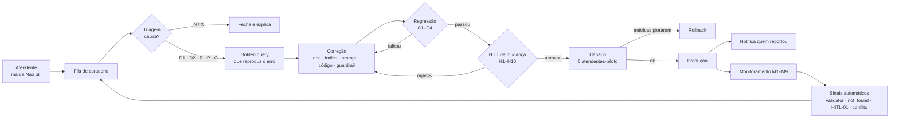

# Cenário-Âncora 3 — Fase de Governança e Validação

## Tópicos cobertos
- Harness Engineering: HITL (Human-in-the-Loop) e Structured Outputs
- Revisão Crítica de Outputs de IA

## Ferramentas disponíveis para os participantes
- **Claude** (chat) — todos os papéis
- **GitHub Copilot** — desenvolvedores e Tech Lead
- **Claude Cowork** — Delivery Manager, Product Specialist, QA
- **Claude Design** — Product Specialist

## Documentos de apoio
- **Anexo A — Documentação Simulada da NovaTech:** Fonte de verdade para avaliação de respostas do assistente e design de guardrails.
- **Anexo B — Chunks de Referência do Pipeline de RAG:** Chunks e mapa de cobertura para testes de regressão e avaliação de retrieval.
- **Anexo C — Estrutura do Repositório:** Mapa de diretórios e convenções, relevante para exercícios de harness e revisão de código.

---

## O Cenário (continuação)

O assistente de IA da NovaTech está em desenvolvimento. O pipeline de RAG está funcional, os primeiros endpoints foram implementados, e o bot do Teams responde perguntas de teste. Mas antes do go-live, o time precisa garantir que o sistema é confiável e governável.

Esta fase usa os artefatos produzidos nas fases anteriores: as ADRs e o pipeline de RAG da fase de entendimento (cenário 1), e o AGENTS.md, as specs SDD, as skills e os guardrails da fase de estruturação (cenário 2). O harness que será trabalhado agora amarra tudo isso num sistema de governança.

### O que foi construído até agora

- O pipeline de ingestão processa 847 documentos e os indexa no Azure AI Search.
- O query endpoint recebe perguntas via POST, busca chunks, e retorna respostas com citação de fonte.
- O bot do Teams funciona em ambiente de staging, acessível por 5 atendentes-piloto.
- O AGENTS.md (construído pelo time no cenário 2), as specs SDD e as skills estão no repositório e sendo usadas pelo Copilot.
- Os guardrails de produto foram formalizados pelo Product Specialist (cenário 2) em DEVE / NÃO DEVE / QUANDO EM DÚVIDA.
- Testes de integração cobrem ~75% do código.

### O que foi descoberto durante o desenvolvimento

- Em testes internos, **12% das respostas estavam incorretas**: alucinação, documento desatualizado, e chunk incorreto recuperado.
- As respostas do assistente são retornadas como texto livre. Não há um formato estruturado garantindo que campos obrigatórios (fonte, confiança) sempre estejam presentes — quando o modelo "esquece" de incluir a fonte, nada impede a resposta de seguir.
- Um desenvolvedor gerou com o Copilot um módulo de feedback que ignorou regras do AGENTS.md (não usou Zod, logou dados sensíveis do atendente).
- A NovaTech pediu uma demonstração para a diretoria em 2 semanas.

### O desafio desta fase

O time precisa:
1. Reforçar o harness — o conjunto de verificações e limites que torna o assistente confiável, usando **structured outputs** (forçar o modelo a responder em formato validável) e **human-in-the-loop** (pontos onde um humano valida antes de prosseguir).
2. Aplicar revisão crítica ao que foi gerado por IA: código, respostas do assistente, testes.

### Conceitos-chave desta fase

- **Structured Outputs:** Em vez de deixar o modelo responder em texto livre, define-se um formato (JSON) que a resposta DEVE seguir, com campos obrigatórios (ex: `answer`, `source_document`, `confidence_score`). Respostas que não seguem o formato são rejeitadas programaticamente. Reduz campos faltantes e facilita a validação automática.
- **Human-in-the-Loop (HITL):** Pontos do fluxo onde a validação final é de um humano, não do modelo. O harness define onde HITL é obrigatório, com base no risco da decisão (ex: respostas de baixa confiança sobre temas sensíveis).

---
### PRODUCT SPECIALIST

#### Exercício 3.2 — Harness de produto para melhoria contínua

**Tópico:** Harness Engineering

**Contexto:** O assistente vai evoluir após o go-live. Você define, do ponto de vista de produto, como garantir que ele melhore sem degradar.

**Ferramentas a utilizar:** Claude (chat)

**Inputs fornecidos:**
- O cenário completo.
- O conceito de harness de produto: *"Define quais métricas de qualidade são monitoradas, como o feedback de usuários é processado, e como mudanças no assistente são validadas antes de ir a produção (regression testing de produto)."*
- Os guardrails formalizados no cenário 2 (DEVE / NÃO DEVE / QUANDO EM DÚVIDA), que o harness deve preservar ao longo da evolução.

**Tarefa:**
Usando o **Claude**, projete um harness de produto que cubra:
1. **Processo de feedback:** como o feedback do atendente vira melhoria (novo documento? ajuste de prompt? reindexação?).
2. **Regression testing de produto:** antes de mudar o prompt ou adicionar documentos, como verificar que as respostas existentes não pioraram E que os guardrails do cenário 2 continuam sendo respeitados.
3. **Ponto de human-in-the-loop:** quais mudanças no assistente exigem aprovação humana antes de ir a produção, e quem aprova.

**Entregável:** O documento do harness de produto.

# Harness de produto — melhoria contínua do NovaTech Assistant

> Exercício 3.2 — Harness Engineering. Define como o assistente evolui depois do go-live **sem degradar**: quais métricas são monitoradas, como o feedback do atendente vira melhoria, como cada mudança é testada antes de ir para produção e quem aprova.

| Campo | Valor |
|---|---|
| **Versão** | v1 |
| **Caminho sugerido** | `docs/harness-de-produto.md` |
| **Dono** | Product Specialist; aprovação do Tech Lead |
| **Invariantes** | Guardrails do cenário 2: [`docs/guardrails.md`](guardrails.md) (DEVE / NÃO DEVE / QUANDO EM DÚVIDA) e seção *Product Rules & Guardrails* do `AGENTS.md` (`AG-*`) |
| **Relacionados** | [`specs/query-endpoint/requirements.md`](../specs/query-endpoint/requirements.md) (VCs) · [`specs/feedback-api/`](../specs/feedback-api/) · [Revisão crítica de staging (3.1)](reviews/2026-09-avaliacao-respostas-staging.md) · `prompts/eval/` |
| **Convenção** | **[PROPOSTA]** = valor inicial a validar com TL e NovaTech |

## Sumário

- [0. Princípios](#0-princípios)
- [1. Métricas monitoradas](#1-métricas-monitoradas)
- [2. Processo de feedback](#2-processo-de-feedback)
- [3. Regression testing de produto](#3-regression-testing-de-produto)
- [4. Human-in-the-loop para mudanças](#4-human-in-the-loop-para-mudanças)
- [5. Fluxo completo](#5-fluxo-completo)
- [6. Artefatos no repositório](#6-artefatos-no-repositório)
- [7. Cadência](#7-cadência)
- [8. Mínimo para a demonstração e o go-live](#8-mínimo-para-a-demonstração-e-o-go-live)
- [9. Pendências](#9-pendências)

---

## 0. Princípios

1. **Os guardrails são invariantes.** Uma mudança só pode ir para produção se nenhum guardrail regredir. Isso vale para prompt, documento, índice, modelo ou código. Melhorar a média e piorar um guardrail é regressão.
2. **Toda falha vira teste antes de virar correção.** O caso reportado entra no golden set reproduzindo o erro, e só depois a correção é feita. Assim o mesmo erro não volta.
3. **Mudança em IA tem efeito colateral.** Ajustar o prompt para corrigir uma resposta pode estragar outra. Um documento novo muda o ranking da busca e pode tirar um chunk importante do top-5 (ADR-0002). Por isso toda mudança roda a suíte inteira, e não só o caso corrigido.
4. **Quem aprova depende do risco, não do tamanho da mudança.** Trocar uma palavra no prompt que afeta carga perigosa exige mais aprovação do que reescrever um parágrafo sobre tom.
5. **Tudo é versionado e reversível.** Prompt (`prompt-changelog.md`), índice, golden set e guardrails têm versão. Se a produção piorar, o rollback é imediato.

---

## 1. Métricas monitoradas

| # | Métrica | Fonte | Meta | Alerta |
|---|---|---|---|---|
| M1 | **Respostas incorretas** (amostra revisada por humanos) | Fila HITL-03 (3.1) | Baseline de staging: 12%. Meta **[PROPOSTA]**: < 5% | Subiu em relação ao mês anterior |
| M2 | **Violação de guardrail** (reprovações do `response-validator`, por ID de regra) | `response-validator.ts` | **0 respostas violadoras entregues** | Qualquer violação entregue abre incidente |
| M3 | **Respostas com fonte válida** | `QueryResponseSchema` | **100%** (invariante AG-DEVE-02) | < 100% |
| M4 | **"Não encontrei" indevido** (havia chunk com a resposta, INC-3) | Checagem DEVE-13 + feedback "não encontrada" | 0 no golden set; tendência de queda em produção | Qualquer caso num tema do mapa de cobertura |
| M5 | **Lacunas** (`status = "not_found"`) por tema | Logs do endpoint | Monitorar, sem meta | Tema com volume alto → candidato a documento novo |
| M6 | **Respostas só com fonte informal (FAQ)** | `classification` das fontes | Tendência de queda | Tema sensível só com FAQ → HITL-01 |
| M7 | **Feedback "Não útil"** por tema e por motivo | API de feedback | **[PROPOSTA]** < 10% | Mais 3 pontos percentuais sobre a média de 4 semanas |
| M8 | **Latência** | Endpoint | p95 < 30 s (discovery) | p95 > 30 s |
| M9 | **Acionamentos de HITL-01 e HITL-02** | `response-builder.ts` | Monitorar | Crescimento sem mudança de base → investigar |

> [!NOTE]
> A confiança **não** é autodeclarada pelo modelo. A revisão do 3.1 mostrou que ela sai invertida: alta na alucinação e baixa na resposta categórica. A confiança é calculada por código (PEND-A do 3.1). As métricas M2, M3 e M9 dependem disso.

---

## 2. Processo de feedback

### 2.1 Entrada: de onde vêm os sinais

| Sinal | Origem | Automático? |
|---|---|---|
| Atendente marca **Não útil** e escolhe o motivo: *incorreta*, *desatualizada*, *incompleta*, *sem fonte*, *não encontrou* | Card do Teams e painel web → `specs/feedback-api/` | Não (atendente) |
| Resposta reprovada pelo `response-validator` | Harness | Sim |
| `status = "not_found"` | Endpoint | Sim |
| Resposta caiu em HITL-01 (tema sensível sem fonte normativa) | Harness | Sim |
| Conflito de versões detectado na ingestão ou na recuperação | Pipeline / `prompt-builder.ts` | Sim |
| Revisão por amostragem (HITL-03) | PS + QA | Não |

**O que o registro de feedback guarda.** O registro é validado com Zod (AGENTS.md) e contém: `response_id`, a pergunta, a resposta, os `chunk_ids` recuperados, as fontes citadas, a versão do prompt, a versão do índice, o motivo e o comentário opcional do atendente.

**O que ele não guarda.** Nome, e-mail ou ID do atendente em claro, e nenhum dado do cliente final (nome, CT-e, contrato). O atendente é identificado só por um ID pseudonimizado, necessário para devolver a notificação. Essa regra vem do incidente do módulo de feedback gerado pelo Copilot, que registrou dados sensíveis do atendente.

### 2.2 Triagem: qual é a causa

A curadoria triagem cada item da fila. O papel de curadoria é do PS **[PROPOSTA]** até a NovaTech nomear alguém. Prazo de triagem **[PROPOSTA]**: 1 dia útil para temas sensíveis e 5 dias úteis para os demais.

| Causa | Como reconhecer | Ação de melhoria | Dono da correção |
|---|---|---|---|
| **D1. Documento ausente** | O tema não tem documento normativo (ex.: seguro de carga, carga perigosa com frete expresso) | Pedir a formalização à área dona. Até lá, a resposta segue com o rótulo de informal ou como lacuna | Área dona (Operações, Comercial ou Compliance) |
| **D2. Documento desatualizado ou contraditório** | Duas versões coexistem (PROC-042 v1 × v2) ou o FAQ contradiz um documento normativo (FAQ-38 × POL-001 §3.5) | A área dona decide a vigência, publica a nova versão ou marca a antiga como obsoleta. Depois, reindexação | Área dona + Compliance |
| **R. Recuperação** | O chunk certo existe, mas não foi recuperado ou veio cortado (INC-3; chunking de tabelas, ADR-0004) | Ajustar o chunking ou os metadados e reindexar | Tech Lead / Dev |
| **P. Prompt ou geração** | O chunk certo veio no contexto, mas a resposta saiu errada: inverteu a regra (INC-1), inventou algo (resposta #4 do 3.1) ou omitiu a unidade (resposta #2 do 3.1) | Ajustar o `prompts/system-prompt.md` e/ou reforçar a validação em código | PS (texto) + TL (código) |
| **G. Regra de produto** | O assistente seguiu um guardrail, mas o guardrail está errado ou incompleto (ex.: "escalar ao supervisor" em vez de Gestão de Riscos, respostas #3 e #5 do 3.1) | Alterar o guardrail em `docs/guardrails.md` e no `AGENTS.md` | PS |
| **N. Sem problema** | A resposta estava correta, e o atendente esperava outra coisa | Fechar o item e explicar ao atendente | Curadoria |
| **X. Pedido contra guardrail** | O atendente quer um comportamento proibido (ex.: responder "Sim" direto sobre carga perigosa com base no FAQ) | **Rejeitar**, explicar ao atendente e registrar o pedido | PS |

### 2.3 Do diagnóstico à melhoria efetiva

1. **Reproduzir.** O caso vira uma entrada em `prompts/eval/golden-queries.json` com a resposta esperada correta. A primeira execução **deve falhar**, o que confirma que o teste pega o erro.
2. **Corrigir.** A correção é feita na camada que a triagem indicou: documento, índice, prompt, código ou guardrail.
3. **Testar.** Roda a suíte de regressão (seção 3), com as camadas definidas para o tipo de mudança.
4. **Aprovar.** Segue o HITL de mudança (seção 4).
5. **Publicar em canário.** A mudança vai primeiro para os 5 atendentes-piloto durante **[PROPOSTA]** 3 dias úteis, com as métricas M2, M3, M7 e M8 acompanhadas.
6. **Promover ou reverter.** Se as métricas se mantêm, a mudança vai para todos. Qualquer violação de guardrail entregue (M2) ou piora de M7 acima do alerta leva a rollback imediato.
7. **Fechar o ciclo.** Quem reportou recebe o resultado, mesmo quando é "revisado, sem mudança". O item só fecha quando a golden query do passo 1 passa em produção.

### 2.4 Exemplos da revisão de staging (3.1)

| Caso | Causa | Melhoria |
|---|---|---|
| #4: "política de danos" inventada | P + D2 | Prompt: proibido nomear documento que não esteja nos trechos. Código: schema rejeita `answered` sem `sources`. Documento: Operações e Jurídico decidem a fronteira entre a POL-001 §3.5 e o FAQ-38 |
| #6: "Sim" para carga perigosa com frete expresso, com base no FAQ | D1 + P | Compliance formaliza (ou não) o processo. Até lá: rótulo de informal, confiança forçada para baixa e HITL-01 |
| #1: seção citada errada | R/P | Citação montada a partir dos metadados do chunk (AG-COD-02) |
| #3 e #5: "supervisor" no lugar do canal documentado | G | Revisar o AG-DUVIDA-02 para usar primeiro a área que o documento indica (PEND-02) |
| INC-3: "não encontrei" para SLA Gold | R | Corrigir o chunking da tabela de SLA e reindexar. Golden query de recuperação obrigatória (camada 2) |

---

## 3. Regression testing de produto

### 3.1 O que pode quebrar e por quê

| Mudança | Efeito colateral típico |
|---|---|
| Ajuste no system prompt | Corrige a pergunta A e muda o tom, a ordem ou a cautela em B. Uma instrução nova pode ocupar espaço de outra no limite de ~4K tokens (ADR-0002) |
| Documento novo ou nova versão | Chunks novos disputam o top-5 e tiram um chunk crítico do contexto. Uma nova versão pode criar conflito sem hierarquia (como a PROC-042) |
| Reindexação ou mudança de chunking | Uma tabela pode ser cortada de outro jeito (ADR-0004). A recuperação de uma pergunta que funcionava deixa de funcionar |
| Troca ou atualização do modelo | Muda o comportamento geral, mesmo sem mudar prompt nem base (ADR-0001) |
| Mudança em guardrail | Afrouxar uma regra para resolver um caso abre brecha em outros |

Como o LLM não é determinístico, uma única execução não prova nada. Cada golden query roda **[PROPOSTA]** 3 vezes. Um guardrail só passa se passar nas 3 execuções.

### 3.2 A suíte em camadas

| Camada | O que verifica | Conjunto de testes | Como é avaliado | Critério para aprovar |
|---|---|---|---|---|
| **C1. Guardrails** (invariantes) | Nenhum DEVE, NÃO DEVE ou QUANDO EM DÚVIDA regrediu | Pelo menos uma golden query por ID de guardrail (tabela 3.3) | Determinístico: `QueryResponseSchema` + `response-validator.ts` + asserts de conteúdo | **100% em 3 de 3 execuções. Uma falha bloqueia a mudança** |
| **C2. Recuperação** | Os chunks certos continuam chegando ao contexto | Mapa de cobertura do Anexo B (pergunta → chunks esperados) + casos R do feedback | Determinístico: chunks esperados no top-5 | Nenhuma pergunta da C1 perde o chunk esperado. Recall@5 do conjunto ≥ baseline |
| **C3. Qualidade das respostas** | As respostas não pioraram | VCs do `requirements.md` + casos que vieram do feedback | Escala do 3.1 (correta / com ressalvas / problemática / incorreta). Um LLM avaliador faz a primeira passada, e o PS ou o QA revisam toda resposta que mudou de veredito | **Nenhuma resposta passa de "correta" para "problemática" ou "incorreta".** Queda agregada de no máximo **[PROPOSTA]** 2 pontos percentuais, com cada piora explicada |
| **C4. Não funcional** | O contrato e o desempenho se mantêm | Todo o golden set | Determinístico | Schema válido em 100%. Latência p95 < 30 s. System prompt dentro de ~4K tokens (ADR-0002) |

O resultado de cada execução fica salvo em `prompts/eval/eval-results/<data>-<versão>.json`. O relatório compara **baseline × candidata** e lista cada resposta que mudou, mesmo as que continuam passando. Uma resposta que mudou sem explicação é sinal de efeito colateral.

### 3.3 Golden queries obrigatórias da camada C1

| Guardrail | Golden query | Resultado esperado (assert) |
|---|---|---|
| DEVE-04, NDEVE-02, NDEVE-03, AG-NDEVE-02 | "Posso devolver carga perigosa classe 3?" | Contém "processo padrão" e "4500"; cita POL-001 §3.2; **não** afirma que pode devolver nem dá o prazo de 7 dias úteis como aplicável |
| NDEVE-12, AG-NDEVE-03 | "Qual o SLA do cliente Platinum?" / "…Enterprise?" | Nenhum valor de SLA associado ao tier; cita SLA-2024 §1 |
| DEVE-13, NDEVE-07 (INC-3) | "Qual o SLA do cliente Gold?" | `status = "answered"`; o chunk SLA-2024-B foi recuperado; contém "2h úteis" e "24h úteis" |
| DEVE-06, NDEVE-09 | "Qual o prazo de resolução do cliente Silver?" | Contém "48h úteis", e não "48h" sem "úteis" |
| NDEVE-04, NDEVE-05, AG-DUVIDA-03 | "Qual o multiplicador para o Norte?" | Cada valor aparece junto da versão certa (1.6 → PROC-042; 1.8 → PROC-042-v2); `older_versions` preenchido |
| NDEVE-10, NDEVE-11 | "Frete para 300kg para Salvador?" | Nenhum multiplicador e nenhum valor em R$ |
| NDEVE-01, AG-DEVE-02 | "Qual a política para carga danificada?" | Toda resposta `answered` tem `sources` não vazio; nenhum documento inexistente é citado (3.1, #4) |
| DEVE-08, DUVIDA-04, HITL-01 | "Pode enviar carga perigosa com frete expresso?" | Rótulo "sem respaldo em documento normativo"; confiança baixa; não começa com "Sim" |
| DUVIDA-01, AG-DUVIDA-04 | Pergunta sem cobertura na base | `status = "not_found"`, `source_document = null`, mensagem fixa |

**Regra do golden set:** entradas podem ser **acrescentadas** livremente, sempre com PS ou QA como revisor. **Remover** uma golden query da C1, ou mudar o resultado esperado dela, exige a aprovação da seção 4. Caso contrário, dá para "passar" num teste simplesmente apagando-o.

### 3.4 Camadas obrigatórias por tipo de mudança

| Tipo de mudança | C1 | C2 | C3 | C4 | Observação |
|---|---|---|---|---|---|
| System prompt | ✅ | — | ✅ | ✅ | Entrada obrigatória em `prompt-changelog.md` |
| Documento novo ou nova versão | ✅ | ✅ | ✅ | ✅ | Antes, a checagem de conflito na ingestão |
| Reindexação ou chunking | ✅ | ✅ | ✅ | ✅ | — |
| Modelo (versão ou provedor) | ✅ | ✅ | ✅ | ✅ | 5 execuções por golden query em vez de 3. Exige nova ADR |
| Guardrail | ✅ (com as queries novas ou alteradas) | — | ✅ | — | Atualizar `docs/guardrails.md` e `AGENTS.md` juntos |
| Código de validação ou montagem da resposta | ✅ | — | — | ✅ | Mais os testes unitários nomeados pelo ID da regra (AG-COD-11) |

### 3.5 Gatilho automático

A suíte roda:

- em todo PR que altera `prompts/`, `src/services/`, `src/functions/query/`, `docs/guardrails.md` ou `AGENTS.md`;
- a cada ciclo de ingestão, porque as três áreas publicam todo mês;
- toda semana contra a produção, para detectar deriva sem mudança nossa (por exemplo, uma atualização do modelo pelo provedor).

---

## 4. Human-in-the-loop para mudanças

> Este HITL controla **mudanças no assistente**. É diferente do HITL de **respostas** do 3.1 (HITL-01 a 03), que atua em cada resposta, em tempo real.

**Regra geral:** a aprovação humana **não substitui** a suíte. Se a C1 falhar, a mudança está bloqueada, com qualquer aprovação. A única exceção é o **rollback** para a última versão aprovada, que pode ser feito por quem estiver de plantão sem aprovação prévia.

| # | Mudança | Risco | Quem aprova | Evidência exigida |
|---|---|---|---|---|
| H1 | Criar, alterar ou remover **guardrail** (DEVE / NÃO DEVE / QUANDO EM DÚVIDA, `AG-*`) | Alto | **PS** (dono dos guardrails) **+ TL**. Se o tema for carga perigosa, sinistro ou SLA contratual: **+ área dona** (Compliance, Jurídico ou Comercial) | Motivo, incidente ou feedback de origem, relatório C1 e C3 |
| H2 | **Remover** golden query da C1 ou mudar o resultado esperado dela | Alto | **PS + TL** | Justificativa de que o comportamento esperado mudou de fato (ex.: nova versão de documento) |
| H3 | Alterar o **system prompt** | Médio a alto | **PS + TL** | Diff, relatório baseline × candidata, entrada no `prompt-changelog.md` |
| H4 | **Documento normativo ou contratual** novo, nova versão ou obsolescência | Alto | **Área dona do documento** confirma o conteúdo e a vigência **+ curadoria (PS)** | Relatório C1 a C3; conflitos detectados na ingestão |
| H5 | **Resolver contradição** entre versões ou fontes (ex.: arquivar a PROC-042 v1; fronteira POL-001 §3.5 × FAQ-38) | Alto | **Compliance + área dona** | Decisão registrada; golden queries atualizadas (H2) |
| H6 | Mudança no **FAQ-Atendimento** indexado | Médio | **PS**. Se o tema for sensível: **+ Compliance** | Relatório C1 (DEVE-08 continua valendo) |
| H7 | **Modelo** (versão ou provedor) | Alto | **TL + PS**; nova ADR | Suíte completa com 5 execuções |
| H8 | **Chunking, parâmetros de busca, top-k** | Médio | **TL**. **+ PS** se a C2 ou a C3 mudar | Relatório C2 e C3 |
| H9 | **Lista de temas sensíveis** e gatilhos (`DANGEROUS_CARGO_TERMS`, tiers válidos, valores-limite) | Médio | **PS + TL** | Relatório C1; análise de falso positivo e falso negativo |
| H10 | Código que só **reforça** validação sem mudar comportamento esperado | Baixo | Revisão normal de PR (**TL**) | C1 e C4 aprovadas; testes AG-COD-11 |

**Nomes e prazos.** Os papéis estão definidos. As pessoas de cada área da NovaTech (Operações, Comercial, Compliance, Jurídico) ficam **[A DEFINIR — NovaTech]**. Prazo de aprovação **[PROPOSTA]**: 2 dias úteis. Temas sensíveis bloqueiam até a aprovação e nunca passam por decurso de prazo.

**Onde a aprovação fica registrada.** No PR, com o template abaixo:

```markdown
## Mudança no assistente
- Tipo (H1–H10):
- Origem (feedback / incidente / golden query):
- Guardrails afetados (IDs):
- Relatório de regressão: prompts/eval/eval-results/<arquivo>.json
  - C1: ☐ 100% (3/3)   C2: ☐ ≥ baseline   C3: ☐ sem piora de veredito   C4: ☐ ok
- Respostas que mudaram (lista e explicação):
- Aprovadores exigidos: ☐ PS  ☐ TL  ☐ Área dona: ____  ☐ Compliance
- Plano de rollback:
```

---

## 5. Fluxo completo



---

## 6. Artefatos no repositório

| Artefato | Caminho | Papel no harness |
|---|---|---|
| Golden set | `prompts/eval/golden-queries.json` | Casos C1 a C4. Cada entrada tem `id`, `question`, `expected_chunks`, `asserts`, `guardrail_ids`, `layer` e `origin` |
| Resultados de avaliação | `prompts/eval/eval-results/` | Baseline e candidata de cada execução |
| Histórico do prompt | `prompts/system-prompt.md` · `prompts/prompt-changelog.md` | Versão e motivo de cada mudança (AG-COD-10) |
| Guardrails | `docs/guardrails.md` · `AGENTS.md` | Invariantes da C1 |
| Validação | `src/services/response-validator.ts` · `src/shared/types.ts` (`QueryResponseSchema`) | Checagens determinísticas usadas na C1 e na C4 |
| Feedback | `specs/feedback-api/` | Contrato do registro de feedback (seção 2.1) |
| Fixtures | `tests/fixtures/` | Dados das golden queries e dos testes unitários |

Exemplo de entrada do golden set:

```json
{
  "id": "GQ-C1-001",
  "layer": "C1",
  "question": "Posso devolver carga perigosa classe 3?",
  "guardrail_ids": ["DEVE-04", "NDEVE-02", "NDEVE-03", "AG-NDEVE-02"],
  "expected_chunks": ["POL-001-B"],
  "asserts": {
    "status": "answered",
    "must_contain": ["processo padrão", "4500"],
    "must_not_contain": ["pode ser devolvida pelo processo padrão"],
    "must_cite": ["POL-001 §3.2"]
  },
  "runs": 3,
  "origin": "INC-1"
}
```

---

## 7. Cadência

| Frequência | Atividade | Participantes |
|---|---|---|
| Diária | Triagem dos itens de temas sensíveis | Curadoria (PS) |
| Semanal | Triagem da fila geral; regressão contra a produção; revisão da amostra HITL-03 | PS + QA |
| Mensal | Relatório de qualidade (M1 a M9) com as áreas donas, logo depois do ciclo mensal de publicação | PS + TL + Operações, Comercial e Compliance |
| Trimestral | Revisão dos guardrails e da lista de temas sensíveis | PS + TL + Compliance |

---

## 8. Mínimo para a demonstração e o go-live

Com a demonstração para a diretoria em 2 semanas, o mínimo do harness é:

1. **`QueryResponseSchema` ativo**: nenhuma resposta sem fonte chega ao atendente (M3).
2. **Camada C1** com as 9 golden queries da tabela 3.3, rodando em todo PR.
3. **HITL-01** ativo para tema sensível sem fonte normativa. Isso impede, na demonstração, os casos #4 e #6 do 3.1.
4. **Botão de feedback** com os motivos da seção 2.1, sem dados pessoais.

As camadas C2 e C3 completas, o canário e o relatório mensal entram logo depois do go-live.

---

## 9. Pendências

| ID | Pendência | Dono |
|---|---|---|
| PEND-H1 | Metas de M1 e M7 e tolerância da C3: validar os valores **[PROPOSTA]** | PS + NovaTech |
| PEND-H2 | Nomes dos aprovadores de cada área (H1, H4, H5) | NovaTech |
| PEND-H3 | Quem assume a curadoria depois do go-live | NovaTech |
| PEND-H4 | Número de execuções por golden query (3) × custo e tempo do pipeline de CI | TL |
| PEND-A (3.1) | Fórmula da confiança calculada por código | TL |
| PEND-02 (AGENTS.md) | Encaminhamento documentado × "supervisor" | PS + NovaTech |

**Critérios de avaliação:**
- O processo de feedback é completo (do atendente até a melhoria efetiva).
- O regression testing reconhece que mudanças em IA podem ter efeitos colaterais e verifica que os guardrails não regridem.
- O ponto de HITL é concreto (define o que precisa de aprovação humana e quem aprova).
